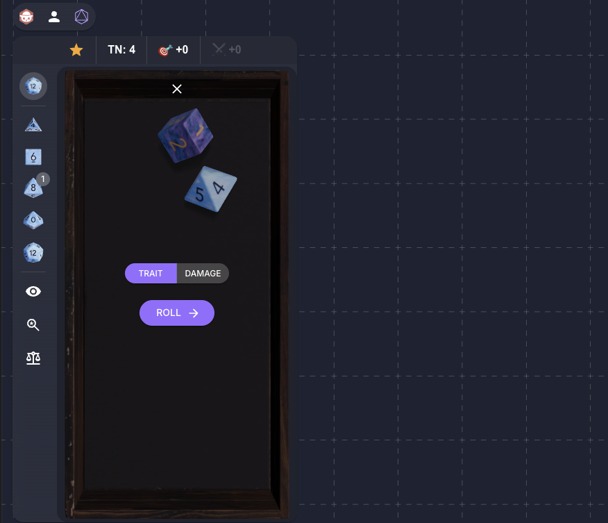

# Savage Worlds Dice

3D dice roller for Savage Worlds Adventure Edition (SWADE), built with React, Three.js, and the Rapier physics engine. Runs as an Owlbear Rodeo extension and standalone for development.



## Features

**SWADE Mechanics**
- Trait tests with optional Wild Die (d6)
- Damage rolls with multiple dice
- Exploding dice on maximum values
- Target number evaluation with raises (every +4 over target)
- Separate modifiers for trait and damage rolls

**Technical**
- Deterministic physics simulation for multiplayer sync
- Real-time 3D animation with Rapier physics engine
- Multiple dice materials and visual styles
- Audio feedback for dice interactions
- Built-in fairness testing with distribution analysis

**Multiplayer**
- Roll result sharing across connected players
- Party roll history popover showing recent rolls from all players
- Private roll option
- Local roll history with settings preservation

## Quick Start

```bash
yarn                # Install dependencies
yarn dev           # Development server at http://localhost:5173
yarn build         # Production build to dist/
yarn preview       # Preview production build
```

## Architecture

**Entry Points**
- `index.html` → Main application (`src/main.tsx` → `src/App.tsx`)
- `popover.html` → Party roll history popover (`src/popover.tsx`)
- `background.html` → Owlbear Rodeo extension registration (`src/background.ts`)

**Key Directories**
- `src/dice/` - Physics simulation, SWADE roll processing, explosion handling
- `src/tray/` - 3D dice tray rendering and interaction
- `src/controls/` - UI components (sidebar, top controls, mode selection)
- `src/plugin/` - Owlbear Rodeo integration (sync, themes, popovers)
- `src/types/` - TypeScript definitions for dice mechanics and SWADE rules
- `src/sets/` - Dice set configurations and visual styles
- `src/materials/`, `src/meshes/`, `src/colliders/` - 3D assets and rendering
- `src/tests/` - Fairness testing tools

**State Management**
- Zustand with Immer for dice rolling state (`src/dice/store.ts`)
- UI controls and SWADE settings (`src/controls/store.ts`)
- Multiplayer roll history (`src/plugin/rollHistoryStore.ts`)

## Technology Stack

- **Frontend**: React 18, TypeScript, Material-UI
- **3D Graphics**: Three.js, @react-three/fiber, @react-three/drei
- **Physics**: Rapier 3D physics engine via @react-three/rapier
- **Build**: Vite with multi-entry configuration
- **Platform**: Owlbear Rodeo SDK integration

## SWADE Implementation

The application implements core Savage Worlds mechanics:
- **Exploding Dice**: Dice showing maximum value roll again, adding to total
- **Wild Die**: Optional d6 rolled with trait tests, best result used
- **Raises**: Success levels calculated in 4-point increments above target number
- **Trait vs Damage**: Separate roll modes with different modifier handling

Roll results are shared between players in the session via Owlbear Rodeo's player metadata system.

## Attributions

d8 icon by Leonardo Henrique Martini from [Noun Project](https://thenounproject.com/browse/icons/term/d8/) (CC BY 3.0)

## License

GNU GPLv3. See LICENSE for details.
