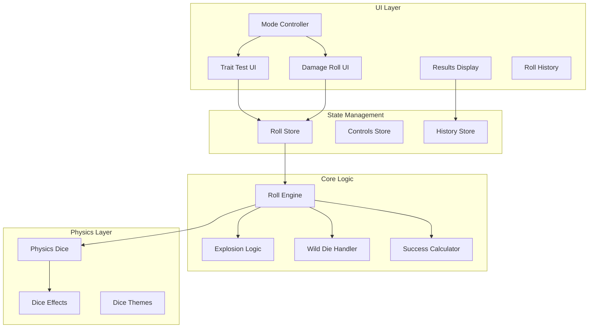

# Technical Design Document

## Overview

This document outlines the technical implementation for converting the D20-based dice roller into a Savage Worlds-specific system. The conversion involves modifying core dice mechanics, introducing exploding dice, implementing wild die support, and redesigning the UI for Savage Worlds gameplay patterns.

## Architecture

### System Architecture



### Mode-Based Architecture

The system will operate in two distinct modes:

1. **Trait Test Mode**: Single trait die + optional wild die with TN evaluation
2. **Damage Roll Mode**: Multiple dice selection without wild die

Mode selection will be handled at the top level of the UI with state persisted across sessions.

## Components and Interfaces

### Core Type Definitions

```typescript
// Update existing types
export type SavageDiceType = "D4" | "D6" | "D8" | "D10" | "D12";

export interface SavageRollMode {
  type: "TRAIT" | "DAMAGE";
}

export interface TraitTestConfig {
  traitDie: SavageDiceType;
  includeWildDie: boolean;
  targetNumber?: number;
  modifier?: number;  // +2 for skill bonus, -2 for wounds, etc.
}

export interface DamageRollConfig {
  dice: Array<{
    type: SavageDiceType;
    count: number;
  }>;
  modifier?: number;  // +1 for STR bonus, +2 for magic weapon, etc.
}

export interface ExplosionResult {
  dieId: string;
  rolls: number[];  // Array of individual rolls in explosion chain
  total: number;
  exploded: boolean;
}

export interface SavageRollResult {
  mode: "TRAIT" | "DAMAGE";
  explosions: ExplosionResult[];
  traitDieResult?: ExplosionResult;
  wildDieResult?: ExplosionResult;
  bestResult?: ExplosionResult;  // For trait tests
  modifier?: number;
  total: number;  // Including modifier
  targetNumber?: number;
  success?: boolean;
  raises?: number;
  timestamp: number;
}
```

### State Management Updates

```typescript
// controls/store.ts modifications
interface SavageControlsState {
  rollMode: "TRAIT" | "DAMAGE";
  
  // Trait test specific
  selectedTraitDie: SavageDiceType;
  wildDieEnabled: boolean;
  targetNumber: number;
  
  // Damage roll specific
  damageDice: Record<SavageDiceType, number>;
  
  // Shared
  modifier: number;  // Can be positive or negative
  
  // Actions
  setRollMode: (mode: "TRAIT" | "DAMAGE") => void;
  setTraitDie: (die: SavageDiceType) => void;
  toggleWildDie: () => void;
  setTargetNumber: (tn: number) => void;
  setDamageDieCount: (die: SavageDiceType, count: number) => void;
  setModifier: (modifier: number) => void;
}

// dice/store.ts modifications
interface SavageDiceRollState {
  currentRoll: SavageRollResult | null;
  explosionQueue: Array<{
    dieId: string;
    dieType: SavageDiceType;
    isWildDie: boolean;
  }>;
  
  startSavageRoll: (config: TraitTestConfig | DamageRollConfig) => void;
  processExplosion: (dieId: string, value: number) => void;
  finalizeSavageRoll: () => void;
}
```

### Core Components

#### Mode Controller Component
```typescript
// controls/ModeController.tsx
interface ModeControllerProps {
  mode: "TRAIT" | "DAMAGE";
  onModeChange: (mode: "TRAIT" | "DAMAGE") => void;
}
```

#### Trait Test Controls
```typescript
// controls/TraitTestControls.tsx
interface TraitTestControlsProps {
  traitDie: SavageDiceType;
  wildDieEnabled: boolean;
  targetNumber: number;
  onTraitDieChange: (die: SavageDiceType) => void;
  onWildDieToggle: () => void;
  onTargetNumberChange: (tn: number) => void;
  onRoll: () => void;
}
```

#### Damage Roll Controls
```typescript
// controls/DamageRollControls.tsx
interface DamageRollControlsProps {
  damageDice: Record<SavageDiceType, number>;
  onDiceCountChange: (die: SavageDiceType, count: number) => void;
  onRoll: () => void;
}
```

#### Results Display Component
```typescript
// controls/SavageResultsDisplay.tsx
interface SavageResultsDisplayProps {
  result: SavageRollResult;
}
```

## Data Models

### Roll Processing Flow

1. **Initial Roll Phase**
   - Generate physics throws for all selected dice
   - Wild die uses distinct color theme
   - Track die IDs for explosion processing

2. **Explosion Detection Phase**
   - Monitor each die result
   - Queue explosions for dice showing max value
   - Generate new physics dice for explosions

3. **Explosion Resolution Phase**
   - Process explosion queue sequentially
   - Animate new dice spawning
   - Continue until no max values or limit reached

4. **Result Calculation Phase**
   - Sum explosion chains for each die
   - Compare trait vs wild die for trait tests
   - Calculate success and raises if TN provided

### Wild Die Visualization

The wild die will use a special theme configuration:
- Override the selected dice theme with a contrasting color
- Maintain the same material properties (glass, metal, etc.)
- Apply a unique identifier/marker to distinguish it

## Error Handling

### Explosion Limit Management
- Track explosion count per die
- Stop at 50 explosions with warning
- Log excessive explosions for debugging

### Invalid State Prevention
- Validate dice selection before rolling
- Ensure at least one die selected
- Prevent negative target numbers

### Physics Failure Recovery
- Timeout handling for stuck dice
- Fallback to calculated results if physics fails
- Clear explosion queue on errors

## Testing Strategy

### Unit Tests
- Explosion logic with various die types
- Success/raise calculations
- Wild die comparison logic
- Mode switching state management

### Integration Tests
- Complete roll flows for both modes
- Explosion chain processing
- Physics simulation with explosions
- History recording with new data

### Visual/Manual Tests
- Wild die color differentiation
- Explosion animation smoothness
- UI mode transitions
- Result display clarity

## Migration Strategy

### Rebranding Steps
1. Update manifest.json with new name and ID
2. Replace all D20 references in UI text
3. Update store metadata and descriptions
4. Modify icons and branding assets

### Feature Removal
1. Remove advantage/disadvantage components
2. Remove D20 and D100 from type definitions
3. Clean up D20-specific roll logic
4. Update dice mesh and collider imports

### State Migration
1. Clear existing roll history on first launch
2. Reset dice counts to Savage Worlds defaults
3. Initialize new mode-specific state

## Performance Considerations

### Explosion Optimization
- Batch physics dice creation for explosions
- Limit concurrent explosion animations
- Pool and reuse dice meshes

### UI Responsiveness
- Debounce die selection in damage mode
- Lazy load mode-specific components
- Optimize re-renders during explosions

## UI/UX Design

### Layout Structure

```
┌─────────────────────────────┐
│      Mode Selector          │
│  [Trait Test] [Damage Roll] │
├─────────────────────────────┤
│                             │
│   Mode-Specific Controls    │
│                             │
│  ┌───────────────────────┐  │
│  │  Trait: Die Selector  │  │
│  │  Wild Die: [✓]        │  │
│  │  TN: [4] [6] [8] [+]  │  │
│  │  Modifier: [-][+2][+] │  │
│  └───────────────────────┘  │
│         - OR -              │
│  ┌───────────────────────┐  │
│  │  Damage Dice:         │  │
│  │  D4: [-][0][+]        │  │
│  │  D6: [-][2][+]        │  │
│  │  D8: [-][1][+]        │  │
│  │  ...                  │  │
│  │  Modifier: [-][+0][+] │  │
│  └───────────────────────┘  │
│                             │
│      [🎲 ROLL DICE]         │
├─────────────────────────────┤
│        Results              │
│  ┌───────────────────────┐  │
│  │ Trait: 8💥+7=15       │  │
│  │ Wild: 6💥+2=8         │  │
│  │ Modifier: +2          │  │
│  │ Total: 17             │  │
│  │ Success! 3 raises!    │  │
│  └───────────────────────┘  │
├─────────────────────────────┤
│      Roll History           │
└─────────────────────────────┘
```

### Visual Indicators
- Explosion emoji (💥) or custom icon immediately after each max value roll
- Color coding: green for success, gold for raises
- Wild die with distinct visual theme
- Mode indicator prominently displayed

## Implementation Priorities

### Phase 1: Core Mechanics
1. Remove D20/D100 support
2. Implement basic exploding dice
3. Create mode switching UI
4. Wild die with visual distinction

### Phase 2: Complete Features
1. Success/raise calculations
2. Detailed results display
3. Roll history updates
4. Explosion animations

### Phase 3: Polish
1. UI refinements
2. Performance optimization
3. Enhanced visual effects
4. Settings persistence